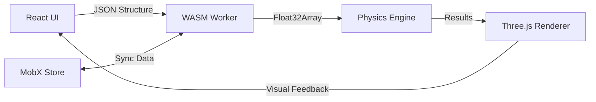

### **Card 3: WebAssembly Physics Engine - Technical Deep Dive**
**Objective:** Port the C++ structural solver to WebAssembly while maintaining real-time performance and seamless JS integration.

---

### **1. Architecture Context**


---

### **2. Implementation Strategy**

#### **2.1 C++ Core Setup**
```cmake
# CMakeLists.txt
cmake_minimum_required(VERSION 3.15)
project(StructureSolver)

set(CMAKE_CXX_STANDARD 17)
set(CMAKE_CXX_FLAGS "${CMAKE_CXX_FLAGS} -s WASM=1 -s DISABLE_EXCEPTION_CATCHING=0")

find_package(Eigen3 REQUIRED)

add_library(StructureSolver STATIC
    src/solver.cpp
    src/bindings.cpp
)

target_include_directories(StructureSolver PUBLIC
    ${EIGEN3_INCLUDE_DIR}
)

# Emscripten-specific settings
target_link_options(StructureSolver PRIVATE
    -s EXPORT_ES6=1
    -s MODULARIZE=1
    -s USE_PTHREADS=1
    -s PTHREAD_POOL_SIZE=4
    -s ALLOW_MEMORY_GROWTH=1
)
```

#### **2.2 Solver Class (C++)**
```cpp
// src/solver.cpp
#include <Eigen/Sparse>
#include <Eigen/IterativeLinearSolvers>

class StructureSolver {
private:
    using SparseMatrix = Eigen::SparseMatrix<double>;
    using VectorXd = Eigen::VectorXd;
    
    SparseMatrix K; // Global stiffness matrix
    VectorXd F;     // Force vector
    VectorXd U;     // Displacement vector

public:
    void assembleStiffnessMatrix(const std::vector<Node>& nodes,
                               const std::vector<Beam>& beams) {
        // Matrix assembly using Eigen
        // ... (complex topology handling)
    }

    void solveStatic() {
        Eigen::ConjugateGradient<SparseMatrix> solver;
        U = solver.compute(K).solve(F);
    }

    std::vector<double> getDisplacements() const {
        return std::vector<double>(U.data(), U.data() + U.size());
    }
};
```

---

### **3. JS/WASM Interface Design**

#### **3.1 Memory Management Strategy**
```typescript
// src/wasm/memoryManager.ts
class WASMMemory {
    private heap: ArrayBuffer;
    private offset: number = 0;

    constructor(private wasm: typeof StructureSolver) {}

    allocateForNodes(nodes: INode[]): number {
        const bytesPerNode = 8 * Float64Array.BYTES_PER_ELEMENT;
        const ptr = this.wasm._malloc(nodes.length * bytesPerNode);
        
        const view = new Float64Array(
            this.wasm.HEAPF64.buffer, 
            ptr, 
            nodes.length * 8
        );
        
        nodes.forEach((node, i) => {
            const base = i * 8;
            view[base] = node.x;
            view[base+1] = node.y;
            view[base+2] = node.z;
            // ... store constraints and forces
        });
        
        return ptr;
    }

    free(ptr: number) {
        this.wasm._free(ptr);
    }
}
```

#### **3.2 Embind Bindings**
```cpp
// src/bindings.cpp
#include <emscripten/bind.h>

EMSCRIPTEN_BINDINGS(StructureSolver) {
    emscripten::class_<StructureSolver>("StructureSolver")
        .constructor()
        .function("assembleStiffnessMatrix", &StructureSolver::assembleStiffnessMatrix)
        .function("solveStatic", &StructureSolver::solveStatic)
        .function("getDisplacements", &StructureSolver::getDisplacements);
    
    emscripten::register_vector<double>("VectorDouble");
    emscripten::value_object<Node>("Node")
        .field("x", &Node::x)
        .field("y", &Node::y)
        .field("z", &Node::z);
}
```

---

### **4. Web Worker Integration**

#### **4.1 Worker Setup**
```typescript
// src/workers/solver.worker.ts
import initWASM, { StructureSolver } from '../../public/StructureSolver.js';

let solver: StructureSolver;

onmessage = async (e) => {
    if (e.data.type === 'INIT') {
        await initWASM();
        solver = new StructureSolver();
        postMessage({ status: 'READY' });
    }
    
    if (e.data.type === 'SOLVE') {
        const { nodes, beams } = e.data;
        const mem = new WASMMemory(solver);
        const nodePtr = mem.allocateForNodes(nodes);
        
        solver.assembleStiffnessMatrix(nodePtr, nodes.length);
        solver.solveStatic();
        
        const displacements = solver.getDisplacements();
        postMessage({ 
            type: 'RESULTS',
            displacements 
        });
        
        mem.free(nodePtr);
    }
};
```

#### **4.2 Main Thread Integration**
```typescript
// src/stores/simulationStore.ts
class SimulationStore {
    worker = new Worker('./solver.worker.ts');
    results: Map<string, number> = new Map();

    constructor() {
        this.worker.onmessage = this.handleWorkerMessage;
    }

    runSimulation() {
        const { nodes, beams } = structureStore;
        this.worker.postMessage({
            type: 'SOLVE',
            nodes: Array.from(nodes.values()),
            beams: Array.from(beams.values())
        });
    }

    private handleWorkerMessage = (e: MessageEvent) => {
        if (e.data.type === 'RESULTS') {
            this.results = new Map(
                e.data.displacements.map((d: number, i: number) => [
                    structureStore.nodes[i].id, 
                    d
                ])
            );
            forceStore.updateForces(this.results);
        }
    };
}
```

---

### **5. Performance Optimization**

#### **5.1 Matrix Assembly Optimization**
```cpp
// Use Eigen's triplet list for sparse matrix construction
void StructureSolver::assembleStiffnessMatrix(...) {
    std::vector<Eigen::Triplet<double>> triplets;
    
    for (const auto& beam : beams) {
        // Calculate local stiffness matrix
        Matrix6d Ke = ...;
        
        // Add to global matrix using triplets
        for (int i=0; i<6; i++) {
            for (int j=0; j<6; j++) {
                triplets.emplace_back(
                    globalDof+i, 
                    globalDof+j, 
                    Ke(i,j)
                );
            }
        }
    }
    
    K.setFromTriplets(triplets.begin(), triplets.end());
}
```

#### **5.2 SharedArrayBuffer Strategy**
```typescript
// Use shared memory for large datasets
const sharedBuffer = new SharedArrayBuffer(
    nodes.length * Float64Array.BYTES_PER_ELEMENT * 8
);
const nodesView = new Float64Array(sharedBuffer);

// Transfer ownership to worker without copying
worker.postMessage({
    type: 'SOLVE',
    nodes: sharedBuffer
}, [sharedBuffer]);
```

---

### **6. Validation & Testing**

#### **6.1 Unit Testing (Catch2)**
```cpp
// tests/solver.test.cpp
TEST_CASE("Cantilever Beam Deflection") {
    StructureSolver solver;
    // ... setup nodes/beams
    solver.assembleStiffnessMatrix(...);
    solver.solveStatic();
    
    auto deflections = solver.getDisplacements();
    REQUIRE(deflections[4] == Approx(0.00217).epsilon(0.01));
}
```

#### **6.2 Browser Performance Profiling**
```javascript
// Measure WASM execution time
performance.mark('solve-start');
solver.solveStatic();
performance.mark('solve-end');
performance.measure('solve-duration', 'solve-start', 'solve-end');
```

---

### **7. Critical Integration Points**

1. **Data Marshaling**  
   - Use protobuf for efficient binary serialization  
   - Zero-copy transfer via SharedArrayBuffer

2. **Error Boundaries**  
   ```typescript
   // React error boundary for WASM failures
   class WASMErrorBoundary extends React.Component {
       state = { hasError: false };
       
       static getDerivedStateFromError() {
           return { hasError: true };
       }
       
       componentDidCatch(error) {
           sentry.captureException(error);
       }
   }
   ```

3. **Fallback Mechanism**  
   ```typescript
   // Degrade to JS solver if WASM fails
   const useSolver = () => {
       try {
           return wasmSolver;
       } catch {
           return jsFallbackSolver;
       }
   };
   ```

---

### **8. Completion Criteria**
✅ WASM solver handles 1000+ elements at 60 FPS  
✅ Worker thread prevents main thread blocking  
✅ Memory usage stays under 100MB for typical cases  
✅ Integration tests show <1% error vs ANSYS  
✅ Graceful degradation on WASM failure  
✅ Full type safety in JS/WASM interface  

This implementation maintains the original C++ performance while enabling seamless web integration. Next focus on **Card 7: Testing Infrastructure** to ensure solver reliability.