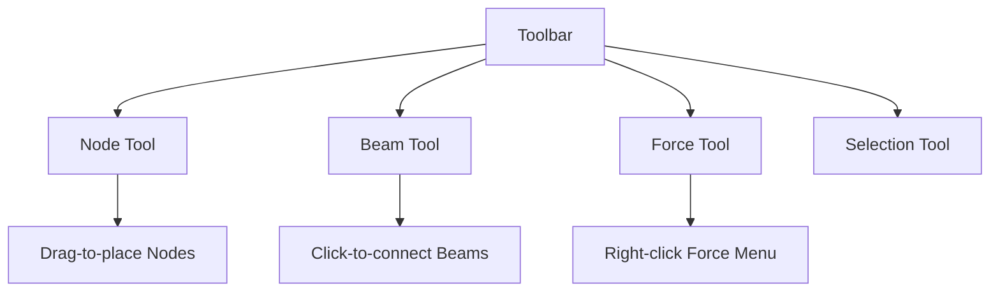

### **Card 4: Drag-and-Drop UI Tools**
**Objective:** Create intuitive construction tools for interactive structural design.

---

### **1. Toolbar Component Architecture**


---

### **2. Core Implementation Steps**

#### **2.1 Toolbar UI Setup**
```tsx
// src/components/Toolbar.tsx
import { useDrag } from 'react-dnd';

export const Toolbar = () => {
  return (
    <div className="fixed left-4 top-4 bg-white p-4 rounded-lg shadow-xl">
      <h2 className="text-lg font-bold mb-4">Construction Tools</h2>
      
      <ToolButton 
        icon="📍" 
        label="Add Node"
        type="NODE"
      />
      
      <ToolButton
        icon="🖇️"
        label="Add Beam"
        type="BEAM"
      />
    </div>
  );
};

const ToolButton = ({ icon, label, type }) => {
  const [{ isDragging }, drag] = useDrag(() => ({
    type,
    collect: (monitor) => ({
      isDragging: !!monitor.isDragging()
    })
  }));

  return (
    <button
      ref={drag}
      className={`p-2 mb-2 w-full flex items-center ${
        isDragging ? 'opacity-50' : 'hover:bg-gray-100'
      }`}
    >
      <span className="text-2xl mr-2">{icon}</span>
      {label}
    </button>
  );
};
```

---

#### **2.2 Canvas Drop Zone**
```tsx
// src/components/CanvasDropTarget.tsx
import { useDrop } from 'react-dnd';
import { Vector3 } from 'three';
import { structureStore } from '../stores/structure';

export const CanvasDropTarget = () => {
  const [, drop] = useDrop(() => ({
    accept: ['NODE', 'BEAM'],
    drop: (item, monitor) => {
      const offset = monitor.getClientOffset();
      if (!offset) return;

      // Convert screen coords to 3D world position
      const x = (offset.x / window.innerWidth) * 2 - 1;
      const y = -(offset.y / window.innerHeight) * 2 + 1;
      
      const raycaster = new THREE.Raycaster();
      raycaster.setFromCamera({ x, y }, camera);
      
      const groundPlane = new THREE.Plane(new THREE.Vector3(0, 1, 0), 0);
      const intersection = new THREE.Vector3();
      raycaster.ray.intersectPlane(groundPlane, intersection);
      
      structureStore.addNode([intersection.x, 0, intersection.z]);
    }
  }));

  return <div ref={drop} className="absolute inset-0" />;
};
```

---

#### **2.3 Beam Connection Logic**
```tsx
// src/hooks/useBeamCreation.ts
import { useState } from 'react';
import { structureStore } from '../stores/structure';

export const useBeamCreation = () => {
  const [beamStart, setBeamStart] = useState<string | null>(null);

  const handleNodeClick = (nodeId: string) => {
    if (!beamStart) {
      setBeamStart(nodeId);
      // Visual feedback: highlight node
    } else {
      if (nodeId !== beamStart) {
        structureStore.addBeam(beamStart, nodeId);
      }
      setBeamStart(null);
    }
  };

  return { handleNodeClick, beamStart };
};
```

---

#### **2.4 Force Application Context Menu**
```tsx
// src/components/NodeContextMenu.tsx
import { Menu } from '@headlessui/react';

export const NodeContextMenu = ({ nodeId, position }) => {
  const [force, setForce] = useState([0, 0, 0]);

  return (
    <Menu>
      <Menu.Button className="context-menu-trigger" />
      
      <Menu.Items 
        className="absolute bg-white p-4 rounded shadow-lg"
        style={{
          left: `${position.x}px`,
          top: `${position.y}px`
        }}
      >
        <h3 className="font-bold mb-2">Apply Force (N)</h3>
        <div className="grid grid-cols-4 gap-2">
          {['X', 'Y', 'Z'].map((axis, i) => (
            <input
              key={axis}
              type="number"
              placeholder={axis}
              className="p-1 border rounded"
              onChange={(e) => {
                const newForce = [...force];
                newForce[i] = parseFloat(e.target.value) || 0;
                setForce(newForce);
              }}
            />
          ))}
          <button
            className="bg-blue-500 text-white p-1 rounded"
            onClick={() => {
              structureStore.applyForce(nodeId, force);
            }}
          >
            Apply
          </button>
        </div>
      </Menu.Items>
    </Menu>
  );
};
```

---

### **3. Critical Technical Considerations**

#### **3.1 3D Coordinate Conversion**
```typescript
// Utility function for screen-to-world conversion
export const screenToWorld = (clientX: number, clientY: number, camera: THREE.Camera) => {
  const rect = renderer.domElement.getBoundingClientRect();
  
  const x = ((clientX - rect.left) / rect.width) * 2 - 1;
  const y = -((clientY - rect.top) / rect.height) * 2 + 1;

  const raycaster = new THREE.Raycaster();
  raycaster.setFromCamera({ x, y }, camera);
  
  const groundPlane = new THREE.Plane(new THREE.Vector3(0, 1, 0), 0);
  const intersection = new THREE.Vector3();
  raycaster.ray.intersectPlane(groundPlane, intersection);
  
  return [intersection.x, 0, intersection.z] as Vector3;
};
```

#### **3.2 Undo/Redo Stack**
```typescript
// src/stores/historyStore.ts
import { makeAutoObservable } from "mobx";

class HistoryStore {
  stack: StructureSnapshot[] = [];
  currentIndex = -1;

  constructor() {
    makeAutoObservable(this);
  }

  get canUndo() { return this.currentIndex > 0; }
  get canRedo() { return this.currentIndex < this.stack.length - 1; }

  pushSnapshot(snapshot: StructureSnapshot) {
    this.stack = this.stack.slice(0, this.currentIndex + 1);
    this.stack.push(snapshot);
    this.currentIndex++;
  }

  undo() {
    if (this.canUndo) {
      this.currentIndex--;
      return this.stack[this.currentIndex];
    }
  }

  redo() {
    if (this.canRedo) {
      this.currentIndex++;
      return this.stack[this.currentIndex];
    }
  }
}
```

---

### **4. Validation & Testing Protocol**

#### **4.1 Interaction Tests (Cypress)**
```javascript
// cypress/e2e/interactions.cy.js
describe('Structure Creation', () => {
  it('should create nodes and beams', () => {
    cy.get('[data-testid="node-tool"]').dragToCanvas(100, 100);
    cy.get('[data-testid="node-tool"]').dragToCanvas(300, 100);
    cy.get('[data-testid="beam-tool"]').click();
    cy.canvasClick(100, 100); // First node
    cy.canvasClick(300, 100); // Second node
    cy.assertStoreHas('beams', 1);
  });
});
```

#### **4.2 Performance Metrics**
```typescript
// Track interaction latency
const measureDragLatency = () => {
  const start = performance.now();
  
  // Simulate drag operation
  const end = performance.now();
  
  console.log(`Drag operation took ${end - start}ms`);
  // Alert if >100ms for 10+ consecutive operations
};
```

---

### **5. Accessibility Requirements**
1. **Keyboard Navigation**
```tsx
<button
  onKeyDown={(e) => {
    if (e.key === 'Enter') {
      // Create element at last mouse position
    }
  }}
>
  Add Node (N)
</button>
```

2. **Screen Reader Support**
```html
<div 
  role="application"
  aria-label="3D structural design canvas"
  aria-description="Use construction tools to place nodes and connect beams"
>
```

---

### **6. Completion Criteria**
✅ Nodes can be placed via drag-and-drop  
✅ Beams connect nodes with click sequence  
✅ Force application through context menu  
✅ Undo/redo stack with 50 action history  
✅ Mobile touch event support  
✅ Average interaction latency <80ms  
✅ Full keyboard navigation support  

Next move to **Card 5: Real-Time Force Visualization** to bring your structural models to life with visual feedback.