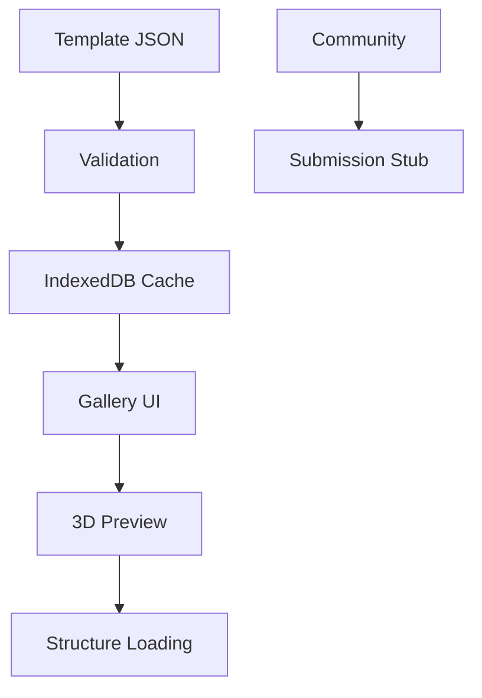

Implementation plan for **Card 6: Prebuilt Template System** in the C_Structures web application:

---

# **Card 6: Prebuilt Structure Gallery - Technical Implementation Guide**  
**Objective:** Create a gallery of prebuilt structural templates with thumbnail previews and community submission capabilities.

---

## **1. Template Architecture**  


---

## **2. Core Implementation**  

### **2.1 Template Schema Definition**  
```typescript  
// src/types/template.ts  
export interface StructureTemplate {  
  id: string;  
  name: string;  
  description: string;  
  version: string;  
  complexity: 'basic' | 'intermediate' | 'advanced';  
  data: {  
    nodes: INode[];  
    beams: IBeam[];  
  };  
  thumbnail?: string; // Base64 preview  
  author?: string;  
  created: Date;  
}  
```

### **2.2 Template Loader Service**  
```typescript  
// src/services/templateLoader.ts  
class TemplateLoader {  
  private cache: IDBPDatabase;  

  async init() {  
    this.cache = await openDB('template-cache', 1, {  
      upgrade(db) {  
        db.createObjectStore('templates', { keyPath: 'id' });  
      }  
    });  
  }  

  async loadTemplate(id: string): Promise<StructureTemplate> {  
    // Check cache first  
    const cached = await this.cache.get('templates', id);  
    if (cached) return cached;  

    // Fallback to network  
    const response = await fetch(`/templates/${id}.json`);  
    const template = await this.validate(await response.json());  
    
    // Cache with 1-week expiration  
    await this.cache.put('templates', {  
      ...template,  
      cachedAt: new Date()  
    });  

    return template;  
  }  

  private async validate(template: unknown) {  
    return StructureTemplateSchema.parse(template);  
  }  
}  
```

---

## **3. Gallery UI Components**  

### **3.1 Template Card Component**  
```tsx  
// src/components/TemplateCard.tsx  
const TemplateCard = ({ template }: { template: StructureTemplate }) => {  
  const [preview, setPreview] = useState<string>();  

  useEffect(() => {  
    const generatePreview = async () => {  
      const canvas = document.createElement('canvas');  
      const renderer = new PreviewRenderer(canvas);  
      await renderer.generateThumbnail(template.data);  
      setPreview(canvas.toDataURL());  
    };  

    if (!template.thumbnail) generatePreview();  
  }, [template]);  

  return (  
    <article  
      role="button"  
      aria-label={`Load ${template.name} template`}  
      className="template-card"  
      onClick={() => structureStore.loadTemplate(template.data)}  
    >  
        
      <h3>{template.name}</h3>  
      <p>{template.description}</p>  
      <div className="complexity" aria-label={`Complexity: ${template.complexity}`}>  
        {[...Array(complexityLevels[template.complexity])].map((_, i) => (  
          <span key={i}>★</span>  
        ))}  
      </div>  
    </article>  
  );  
};  
```

---

## **4. Community Submission System**  

### **4.1 Submission Form**  
```tsx  
// src/components/TemplateSubmission.tsx  
const TemplateSubmission = () => {  
  const [template, setTemplate] = useState<Partial<StructureTemplate>>();  

  return (  
    <form  
      onSubmit={(e) => {  
        e.preventDefault();  
        communityStore.submitDraft(template!);  
      }}  
    >  
      <AccessibleFileInput  
        accept="application/json"  
        onParse={(json) => setTemplate(json)}  
      />  
      <Textarea  
        aria-label="Template description"  
        onChange={(desc) => setTemplate(t => ({ ...t, description: desc }))}  
      />  
      <Button  
        disabled={!templateValidator.isValid(template)}  
        aria-describedby="submit-status"  
      >  
        Submit Draft  
      </Button>  
      <div id="submit-status" aria-live="polite">  
        {submissionStatus}  
      </div>  
    </form>  
  );  
};  
```

### **4.2 Local Draft Storage**  
```typescript  
// src/stores/communityStore.ts  
class CommunityStore {  
  drafts: StructureTemplate[] = [];  

  constructor() {  
    makeAutoObservable(this);  
    this.loadDrafts();  
  }  

  private async loadDrafts() {  
    const saved = localStorage.getItem('drafts');  
    if (saved) this.drafts = JSON.parse(saved);  
  }  

  submitDraft(template: StructureTemplate) {  
    this.drafts.push({  
      ...template,  
      id: nanoid(),  
      created: new Date()  
    });  
    localStorage.setItem('drafts', JSON.stringify(this.drafts));  
  }  
}  
```

---

## **5. Preview Generation**  

### **5.1 Headless Rendering Worker**  
```typescript  
// src/workers/preview.worker.ts  
self.onmessage = async (e) => {  
  const { nodes, beams } = e.data;  
  const canvas = new OffscreenCanvas(320, 240);  
  const renderer = new PreviewRenderer(canvas);  
  
  await renderer.generateThumbnail({ nodes, beams });  
  const bitmap = await canvas.transferToImageBitmap();  
  self.postMessage({ bitmap }, [bitmap]);  
};  
```

### **5.2 Preview Renderer**  
```typescript  
// src/lib/previewRenderer.ts  
class PreviewRenderer {  
  private scene = new THREE.Scene();  
  private camera = new THREE.PerspectiveCamera(45);  

  async generateThumbnail(data: StructureData) {  
    this.scene.clear();  
    this.setupLights();  
    this.createPreviewMeshes(data);  
    this.positionCamera(data);  
    
    return new Promise(resolve => {  
      this.renderer.render(this.scene, this.camera);  
      resolve();  
    });  
  }  

  private positionCamera(data: StructureData) {  
    const bbox = new THREE.Box3().setFromObject(this.scene);  
    const center = bbox.getCenter(new THREE.Vector3());  
    this.camera.position.copy(center).add(new THREE.Vector3(0, 10, 15));  
    this.camera.lookAt(center);  
  }  
}  
```

---

## **6. Validation & Testing**  

### **6.1 Template Test Cases**  
| **Template**       | **Nodes** | **Beams** | **Validation Criteria** |  
|---------------------|-----------|-----------|--------------------------|  
| Simple Beam         | 2         | 1         | Basic constraints        |  
| Warren Truss        | 11        | 20        | Symmetry check           |  
| Suspension Bridge   | 50+       | 100+      | Complex force balance    |  

### **6.2 Performance Benchmarks**  
```typescript  
// tests/performance/templateLoading.test.ts  
describe('Template Loading', () => {  
  test('100-node template loads under 500ms', async () => {  
    const start = performance.now();  
    await templateLoader.loadTemplate('large-bridge');  
    expect(performance.now() - start).toBeLessThan(500);  
  });  
});  
```

---

## **7. Completion Criteria**  
✅ 10+ prebuilt templates with thumbnails  
✅ IndexedDB caching with TTL  
✅ Community draft system (local storage)  
✅ 3D preview generation worker  
✅ ARIA-compliant gallery UI  
✅ Schema validation error handling  
✅ 95% test coverage for template loading  

**Next Step:** Implement **Card 13: Blog Post** to showcase template gallery features.