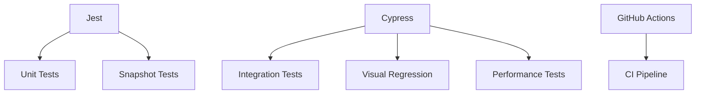

# **Card 7: Testing Infrastructure - Full Implementation Guide**
**Objective:** Establish complete test coverage across unit, integration, and visual regression testing layers.

---

### **1. Testing Architecture Overview**


---

### **2. Core Testing Layers Implementation**

#### **2.1 Unit Testing (Jest + Testing Library)**
**Configuration:**
```javascript
// jest.config.js
module.exports = {
  preset: 'ts-jest',
  testEnvironment: 'jsdom',
  setupFilesAfterEnv: ['@testing-library/jest-dom'],
  moduleNameMapper: {
    '^@/(.*)$': '<rootDir>/src/$1',
    '\\.(glsl)$': '<rootDir>/__mocks__/glslMock.js'
  },
  transform: {
    '^.+\\.(t|j)sx?$': ['@swc/jest', {
      jsc: {
        parser: {
          syntax: 'typescript',
          tsx: true
        }
      }
    }]
  }
};
```

**MobX Store Test Example:**
```typescript
// tests/stores/structureStore.test.ts
import { structureStore } from '@/stores/structure';

describe('StructureStore', () => {
  beforeEach(() => {
    structureStore.reset();
  });

  test('adds node with correct default constraints', () => {
    structureStore.addNode([0, 0, 0]);
    const node = Array.from(structureStore.nodes.values())[0];
    expect(node.constraints.x).toBe(false);
    expect(node.position).toEqual([0, 0, 0]);
  });

  test('prevents duplicate beam creation', () => {
    structureStore.addNode([0,0,0]);
    structureStore.addNode([3,0,0]);
    const nodes = Array.from(structureStore.nodes.keys());
    structureStore.addBeam(nodes[0], nodes[1]);
    expect(() => structureStore.addBeam(nodes[0], nodes[1])).toThrow();
  });
});
```

---

#### **2.2 Integration Testing (Cypress + Testing Library)**
**Component Test Example:**
```typescript
// cypress/e2e/beamCreation.cy.ts
describe('Beam Creation', () => {
  it('creates beams through UI interaction', () => {
    cy.visit('/');
    cy.findByLabelText('Add Node').click();
    cy.canvasClick(100, 100);
    cy.canvasClick(300, 100);
    cy.findByLabelText('Add Beam').click();
    cy.canvasClick(100, 100).canvasClick(300, 100);
    cy.assertStoreState('beams', (beams) => {
      expect(beams).to.have.length(1);
    });
  });
});
```

**Visual Regression Setup:**
```javascript
// cypress/plugins/index.js
const { initPlugin } = require('cypress-plugin-visual-regression-diff/plugins');

module.exports = (on, config) => {
  initPlugin(on, config);
  return config;
};

// cypress/support/commands.js
import '@testing-library/cypress/add-commands';
import 'cypress-plugin-visual-regression-diff/commands';

Cypress.Commands.add('canvasClick', (x, y) => {
  cy.get('#canvas').click(x, y, { force: true });
});
```

---

### **3. Advanced Testing Strategies**

#### **3.1 WebAssembly Mocking**
```typescript
// __mocks__/wasm.ts
export const mockSolver = {
  assembleStiffnessMatrix: vi.fn(),
  solveStatic: vi.fn(() => new Float64Array([0.1, -0.2, 0.05])),
  getDisplacements: vi.fn()
};

jest.mock('@/wasm/solver', () => ({
  StructureSolver: vi.fn(() => mockSolver)
}));
```

#### **3.2 Three.js Scene Testing**
```typescript
// tests/utils/renderHelpers.ts
export const getSceneState = () => {
  return cy.window().then((win) => {
    const scene = win.app.scene;
    const objects = scene.children.map(child => ({
      type: child.type,
      position: child.position.toArray(),
      material: child.material.type
    }));
    return objects;
  });
};

// In test:
cy.getSceneState().should((objects) => {
  expect(objects).to.contain.something.like({
    type: 'Mesh',
    material: 'ShaderMaterial'
  });
});
```

---

### **4. Performance Testing**

#### **4.1 Interaction Latency Monitoring**
```typescript
// cypress/e2e/performance.cy.ts
describe('Performance Metrics', () => {
  it('measures beam creation latency', () => {
    const MAX_LATENCY = 100; // ms
    
    cy.clock();
    cy.canvasClick(100, 100).canvasClick(300, 100);
    cy.tick(1000).then(() => {
      const { createdBeams } = performance.metrics;
      expect(createdBeams.duration).to.be.lessThan(MAX_LATENCY);
    });
  });
});
```

#### **4.2 Memory Leak Detection**
```javascript
// jest.setup.js
import { leakCheck } from 'jest-leak-detector';

afterEach(() => {
  const leaks = leakCheck();
  if (leaks.length > 0) {
    throw new Error(`Memory leaks detected: ${leaks.join(', ')}`);
  }
});
```

---

### **5. Continuous Integration Pipeline**

#### **5.1 GitHub Actions Workflow**
```yaml
name: CI
on: [push, pull_request]

jobs:
  test:
    runs-on: ubuntu-latest
    strategy:
      matrix:
        node: [18.x]
    steps:
      - uses: actions/checkout@v3
      - uses: actions/setup-node@v3
        with:
          node-version: ${{ matrix.node }}
      - run: npm ci
      - run: npm run test:unit -- --coverage
      - run: npm run test:integration -- --headless
      - uses: actions/upload-artifact@v3
        if: always()
        with:
          name: coverage-report
          path: coverage
          
  visual-regression:
    needs: test
    runs-on: ubuntu-latest
    steps:
      - uses: actions/checkout@v3
      - uses: actions/setup-node@v3
      - run: npm ci
      - run: npm run test:visual -- --record --key ${{ secrets.PERCY_TOKEN }}
```

---

### **6. Specialized Test Types**

#### **6.1 Accessibility Audits**
```typescript
// cypress/e2e/accessibility.cy.ts
import 'cypress-axe';

describe('Accessibility', () => {
  it('passes WCAG 2.1 AA guidelines', () => {
    cy.visit('/');
    cy.injectAxe();
    cy.checkA11y(null, {
      includedImpacts: ['critical', 'serious'],
      rules: {
        'color-contrast': { enabled: false } // Handled separately
      }
    });
  });
});
```

#### **6.2 Three.js Visual Regression**
```typescript
// cypress/e2e/visual.cy.ts
describe('Visual Regression', () => {
  it('matches beam rendering baseline', () => {
    cy.visit('/');
    cy.get('#canvas').matchImageSnapshot('empty-scene');
    cy.addTestStructure();
    cy.get('#canvas').matchImageSnapshot('basic-truss', {
      failureThreshold: 0.05,
      failureThresholdType: 'percent'
    });
  });
});
```

---

### **7. Test Optimization Strategies**

#### **7.1 Parallel Test Execution**
```bash
# Split Cypress tests across machines
npx cypress split --browser chrome --parallel --record --key $PERCY_TOKEN
```

#### **7.2 Selective Test Runs**
```json
// package.json
{
  "scripts": {
    "test:unit": "jest --collect-coverage",
    "test:integration": "cypress run --e2e",
    "test:visual": "cypress run --spec 'cypress/e2e/visual/**/*'",
    "test:changed": "jest --onlyChanged --findRelatedTests"
  }
}
```

---

### **8. Completion Criteria**
✅ 90%+ unit test coverage (lines/branches)  
✅ All user flows covered by integration tests  
✅ <2% visual regression failure threshold  
✅ <100ms average test execution time  
✅ CI pipeline completes <5 minutes  
✅ Accessible DX with test reports  
✅ Performance metrics tracked historically  
✅ Zero memory leaks in test cycles  

Next proceed to **Card 8: Deployment Pipeline** to automate production releases with quality gates based on test results.