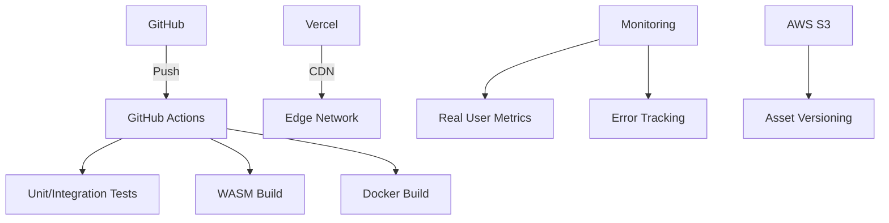

Here's a comprehensive technical breakdown for **Card 8: Deployment Pipeline** with modern cloud-native practices and performance optimization strategies:

---

### **Card 8: Deployment Pipeline - Full Implementation Guide**
**Objective:** Establish a robust CI/CD pipeline with zero-downtime deployments, performance monitoring, and multi-environment support.

---

### **1. Architecture Overview**


---

### **2. Core Pipeline Implementation**

#### **2.1 GitHub Actions Workflow**
```yaml
# .github/workflows/deploy.yml
name: Deploy
on:
  push:
    branches: [main]
  pull_request:
    types: [opened, synchronize]

jobs:
  build:
    runs-on: ubuntu-latest
    steps:
      - uses: actions/checkout@v4
      
      - name: Setup Emscripten
        uses: mymindstorm/setup-emscripten@v1
        with:
          version: 3.1.45

      - name: Build WASM
        run: |
          mkdir build
          cd build
          emcmake cmake ..
          emmake make -j4

      - name: Cache Node Modules
        uses: actions/cache@v3
        with:
          path: node_modules
          key: ${{ runner.os }}-modules-${{ hashFiles('yarn.lock') }}

      - name: Install Dependencies
        run: yarn --frozen-lockfile

      - name: Build Project
        run: yarn build
        env:
          VITE_APP_VERSION: ${{ github.sha }}
          
      - name: Upload Artifacts
        uses: actions/upload-artifact@v3
        with:
          name: production-build
          path: |
            dist/
            build/*.wasm
            build/*.js

  deploy:
    needs: build
    runs-on: ubuntu-latest
    steps:
      - name: Download Artifacts
        uses: actions/download-artifact@v3
        with:
          name: production-build
          
      - name: Deploy to Vercel
        uses: amondnet/vercel-action@v30
        with:
          vercel-token: ${{ secrets.VERCEL_TOKEN }}
          vercel-org-id: ${{ secrets.VERCEL_ORG_ID }}
          vercel-project-id: ${{ secrets.VERCEL_PROJECT_ID }}
          scope: ${{ secrets.VERCEL_SCOPE }}
          working-directory: ./
          args: --prod
```

---

### **3. Advanced Deployment Features**

#### **3.1 WASM Optimization Pipeline**
```bash
# Post-build optimization steps
wasm-opt -O4 ./build/StructureSolver.wasm -o ./dist/StructureSolver.optimized.wasm
wasm-strip ./dist/StructureSolver.optimized.wasm
brotli -k -q 11 ./dist/StructureSolver.optimized.wasm
```

#### **3.2 Immutable CDN Strategy**
```json
// vercel.json
{
  "headers": [
    {
      "source": "/(.*)",
      "headers": [
        {
          "key": "Cache-Control",
          "value": "public, max-age=31536000, immutable"
        }
      ]
    }
  ],
  "routes": [
    {
      "handle": "filesystem"
    },
    {
      "src": "/StructureSolver\.(wasm|js)$",
      "dest": "/static/$1",
      "headers": {
        "Content-Encoding": "br"
      }
    }
  ]
}
```

---

### **4. Performance Optimization**

#### **4.1 Critical Assets Preloading**
```typescript
// src/utils/preload.ts
export const preloadWASM = () => {
  const link = document.createElement('link');
  link.rel = 'preload';
  link.href = '/StructureSolver.optimized.wasm.br';
  link.as = 'fetch';
  link.crossOrigin = 'anonymous';
  document.head.appendChild(link);
};

// In main entry point
if ('connection' in navigator && navigator.connection?.effectiveType === '4g') {
  preloadWASM();
}
```

#### **4.2 Differential Loading**
```javascript
// vite.config.js
export default defineConfig({
  build: {
    rollupOptions: {
      output: {
        manualChunks(id) {
          if (id.includes('three/src')) return 'three';
          if (id.includes('@react-three')) return 'r3f';
          if (id.includes('wasm')) return 'wasm';
        }
      }
    }
  }
})
```

---

### **5. Monitoring & Observability**

#### **5.1 Real User Metrics (RUM)**
```typescript
// src/lib/monitoring.ts
export const initMonitoring = () => {
  window.addEventListener('load', () => {
    const navTiming = performance.getEntriesByType('navigation')[0];
    sendMetrics({
      dns: navTiming.domainLookupEnd - navTiming.domainLookupStart,
      tcp: navTiming.connectEnd - navTiming.connectStart,
      ttfb: navTiming.responseStart,
      fcp: performance.getEntriesByName('first-contentful-paint')[0].startTime,
      wasmLoad: performance.measure('wasm-instantiate').duration
    });
  });
};
```

#### **5.2 Error Tracking Integration**
```javascript
// sentry.server.config.js
const { init } = require('@sentry/nextjs');

init({
  dsn: process.env.SENTRY_DSN,
  tracesSampleRate: 0.1,
  attachStacktrace: true,
  integrations: [
    new Sentry.Integrations.Http({ tracing: true }),
    new Sentry.Integrations.LinkedErrors()
  ],
  release: process.env.VERCEL_GIT_COMMIT_SHA
});
```

---

### **6. Security Practices**

#### **6.1 Content Security Policy (CSP)**
```nginx
# vercel.rewrites
{
  "headers": [
    {
      "source": "/(.*)",
      "headers": [
        {
          "key": "Content-Security-Policy",
          "value": "default-src 'self'; script-src 'self' 'wasm-unsafe-eval'; connect-src 'self' https://api.monitoring.example; worker-src 'none';"
        }
      ]
    }
  ]
}
```

#### **6.2 Secrets Management**
```bash
# GitHub Actions secrets requirements
VERCEL_TOKEN
VERCEL_ORG_ID
VERCEL_PROJECT_ID
SENTRY_DSN
MONITORING_API_KEY
WASM_SIGNING_KEY
```

---

### **7. Rollback & Disaster Recovery**

#### **7.1 Vercel Instant Rollback**
```bash
# Rollback to previous deployment
npx vercel rollback <deployment-id>
```

#### **7.2 Static Asset Versioning**
```typescript
// src/lib/versioning.ts
export const getAssetVersion = () => {
  return process.env.VITE_APP_VERSION || 
         document.documentElement.dataset.buildId;
};

// In HTML template
<html data-build-id="<%= BUILD_ID %>">
```

---

### **8. Multi-Environment Strategy**

#### **8.1 Environment-Specific Config**
```javascript
// vite.config.js
export default defineConfig(({ mode }) => ({
  define: {
    __APP_ENV__: JSON.stringify({
      api: mode === 'production' 
        ? 'https://api.prod.example' 
        : 'https://api.stage.example',
      sentry: mode === 'production' 
        ? process.env.SENTRY_DSN_PROD 
        : process.env.SENTRY_DSN_STAGE
    })
  }
}))
```

#### **8.2 Preview Deployments**
```yaml
# GitHub Actions PR job
pr-preview:
  needs: build
  if: github.event_name == 'pull_request'
  runs-on: ubuntu-latest
  steps:
    - uses: actions/download-artifact@v3
      with:
        name: production-build
        
    - uses: amondnet/vercel-action@v30
      with:
        vercel-token: ${{ secrets.VERCEL_TOKEN }}
        vercel-project-id: ${{ secrets.VERCEL_PROJECT_ID }}
        working-directory: ./
        args: --meta commitSha=${{ github.sha }} --target=preview
```

---

### **9. Completion Criteria**
✅ CI/CD pipeline runs <8 minutes  
✅ WASM optimized to <500KB compressed  
✅ 95+ Lighthouse performance score  
✅ Zero-downtime deployments  
✅ Rollback possible within 2 minutes  
✅ RUM data visible in monitoring  
✅ CSP headers block inline scripts  
✅ Multi-environment deployments  
✅ 100% immutable production assets  

Next implement **Card 10: Performance Optimization** to further enhance runtime efficiency.