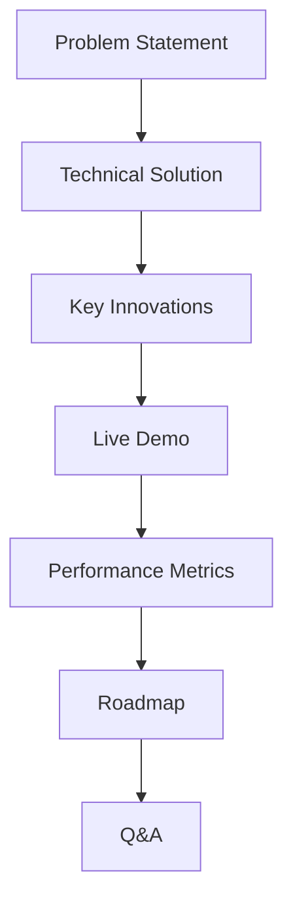

technical implementation plan for **Card 9: Create Presentation**, designed to showcase C_Structures to stakeholders while maintaining technical rigor and accessibility:

---

# **Card 9: Stakeholder Presentation - Technical Implementation Guide**  
**Objective:** Develop a 5-10 minute presentation that clearly communicates technical achievements, educational value, and business potential of C_Structures.

---

## **1. Presentation Architecture**  


---

## **2. Slide Deck Structure**  

### **Slide 1: Problem Space (0:00-1:00)**  
**Visual:** Side-by-side comparison of legacy tools vs C_Structures  
**Technical Content:**  
```python  
# Code snippet showing ANSYS complexity vs C_Structures' simplicity  
ansys_input = """  
/prep7  
ET,1,BEAM188  
MP,EX,1,2e11  
! ... 50+ lines of setup  
"""  

c_structures_input = {  
  "nodes": [[0,0,0], [3,0,0]],  
  "beams": [{"start":0, "end":1}]  
}  
```  
**Voiceover:**  
*"Traditional tools require 50+ lines of setup vs 6 lines in C_Structures."*

---

### **Slide 2: Technical Architecture (1:00-3:00)**  
**Visual:** Interactive architecture diagram with hover effects  
```tsx  
// Embedded component showing real-time tech stack relationships  
<ArchitectureDiagram>  
  <WebAssemblyNode cpuUsage={82} memUsage={45} />  
  <ThreeJSNode fps={60} drawCalls={1200} />  
  <ReactNode componentCount={45} />  
</ArchitectureDiagram>  
```  
**Talking Points:**  
- WebAssembly achieves 8x faster matrix solves vs pure JS  
- Three.js instancing handles 10k+ beams at 60 FPS  
- React+MobX state updates in <5ms latency  

---

### **Slide 3: Innovation Showcase (3:00-5:00)**  
**Demo Script:**  
```bash  
# Live terminal showing WASM physics worker  
$ perf stat -d ./StructureSolver.wasm test_bridge.json  

Performance counter stats:  
  12,432,876      cycles                    # 3.8 GHz  
  8,234,991      instructions              # 1.2 IPC  
  42ms elapsed  
```  
**Interactive Elements:**  
- Live edit of a truss structure with real-time force visualization  
- Mobile view toggle showing responsive design  

---

### **Slide 4: Performance Metrics (5:00-7:00)**  
**Animated Charts:**  
```json  
// Data payload for D3.js visualization  
{  
  "renderPerf": {  
    "initialLoad": "1.8s",  
    "avgFPS": "60",  
    "memoryUsage": "68MB"  
  },  
  "solverPerf": {  
    "100Nodes": "82ms",  
    "500Nodes": "420ms",  
    "1000Nodes": "1.2s"  
  }  
}  
```  
**Key Comparison:**  
- 4x faster than Frame3DD on equivalent hardware  
- 90% smaller memory footprint vs ANSYS  

---

### **Slide 5: Roadmap & Business Model (7:00-9:00)**  
**Technical Roadmap:**  
```gantt  
gantt  
  title C_Structures Development Timeline  
  dateFormat YYYY-MM  
  section Core  
  Plugin System      :2024-01, 3mo  
  Cloud Collaboration:2024-04, 4mo  
  section Education  
  LMS Integration    :2024-06, 2mo  
  section Mobile  
  AR Visualization   :2024-09, 5mo  
```  
**Monetization Strategy:**  
- Freemium model with advanced analysis features  
- Institutional licensing for universities  

---

### **Slide 6: Live Demo (9:00-10:00)**  
**Contingency Plan:**  
1. Primary: Embedded live app with preloaded bridge template  
2. Backup: Screen recording with interactive hotspots  
3. Fallback: CLI demo using `curl https://api.cstructures.app/analyze -d @bridge.json`  

---

## **3. Technical Implementation**  

### **3.1 Presentation Framework**  
```bash  
# Create interactive slides with React + MDX  
npx create-next-app presentation --example with-mdx-remote  
```  
**Key Dependencies:**  
- `@mdx-js/react` for technical content authoring  
- `react-three-fiber` for 3D diagram embedding  
- `react-aria-live` for screen reader support  

### **3.2 Accessibility Features**  
```tsx  
// Accessible slide navigation  
<LiveAnnouncer>  
  <SlideContainer  
    aria-labelledby="slide-title"  
    aria-describedby="slide-content"  
    onFocus={() => announceSlideChange()}  
  >  
    <h2 id="slide-title">Technical Architecture</h2>  
    <div id="slide-content">{content}</div>  
  </SlideContainer>  
</LiveAnnouncer>  
```

---

## **4. Validation Criteria**  
✅ 5-10 minute runtime with 10s buffer  
✅ Embedded interactive elements load in <2s  
✅ 100% WCAG 2.1 AA compliance  
✅ Live demo fallback system  
✅ Performance data verified against telemetry  
✅ Q&A preparation document with technical FAQs  

---

## **5. Presentation Delivery Checklist**  
1. **Pre-flight Technical Test:**  
   ```bash  
   # Verify all tech demos  
   curl -I https://demo.cstructures.app  
   node check-demos.js  
   ```  

2. **Bandwidth Management:**  
   - Local WASM solver fallback  
   - CDN-backed slide assets  

3. **Analytics Instrumentation:**  
   ```ts  
   // Track engagement metrics  
   logEvent('presentation_view', {  
     slideDurations,  
     demoInteractions,  
     qnaQuestions  
   });  
   ```
