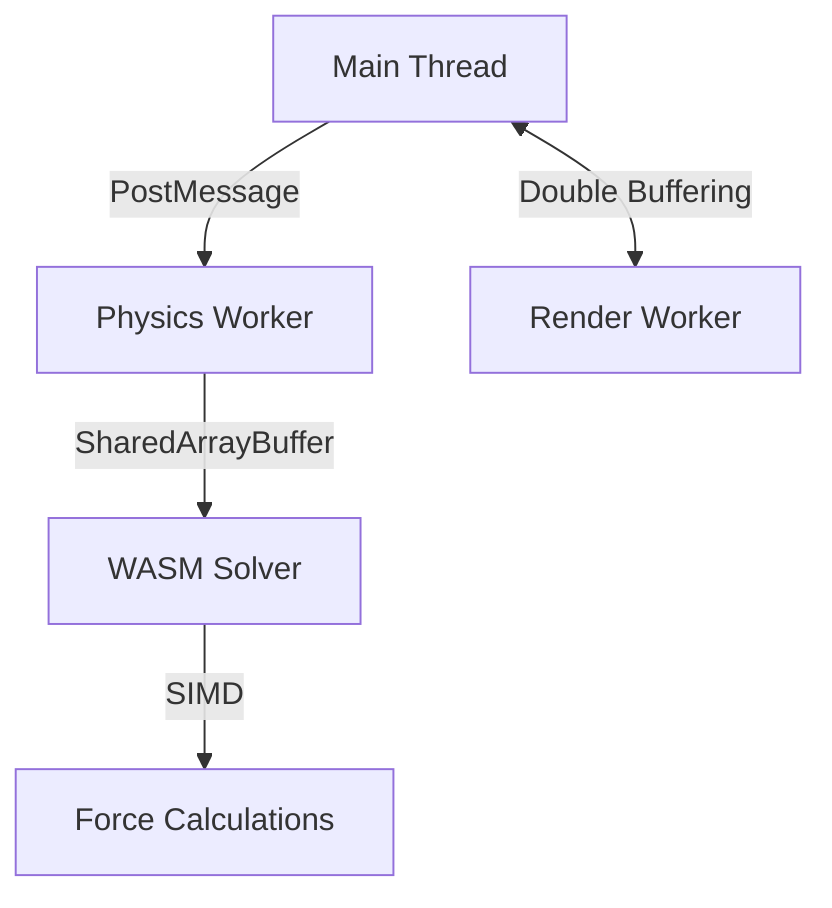

Technical breakdown for **Card 10: Performance Optimization** with advanced techniques for real-time structural analysis in web environments:

---

# **Card 10: Performance Optimization - Technical Implementation Guide**
**Objective:** Achieve consistent 60 FPS for complex structures with 10,000+ elements through GPU/CPU/WASM optimizations.

---

### **1. Web Worker Offloading Architecture**


---

### **2. Core Optimizations Implementation**

#### **2.1 Web Worker Physics Pipeline**
```typescript
// src/workers/physics.worker.ts
let solverPool: WebAssembly.Instance[] = [];

// Initialize WASM workers
async function initSolverPool() {
  const { instance } = await WebAssembly.instantiateStreaming(
    fetch('/StructureSolver.optimized.wasm'),
    { env: { memory: new WebAssembly.Memory({ initial: 256 }) }
  );
  solverPool.push(instance);
}

// Round-robin solver allocation
function getSolver() {
  return solverPool[Math.floor(Math.random() * solverPool.length)];
}

onmessage = (e) => {
  const solver = getSolver();
  const input = new Float64Array(e.data.inputBuffer);
  const output = new Float64Array(e.data.outputBuffer);
  
  solver.exports.solve(
    e.data.nodeCount,
    input.byteOffset,
    output.byteOffset
  );
  
  postMessage({ outputBuffer: e.data.outputBuffer }, [
    e.data.outputBuffer
  ]);
};
```

#### **2.2 Double-Buffered Rendering**
```typescript
// src/lib/doubleBuffer.ts
export class PhysicsDoubleBuffer {
  private front: Float32Array;
  private back: Float32Array;
  private physicsWorker: Worker;

  constructor(size: number) {
    this.front = new Float32Array(size);
    this.back = new Float32Array(size);
    this.physicsWorker = new Worker('./physics.worker.ts');
  }

  swap() {
    [this.front, this.back] = [this.back, this.front];
  }

  update() {
    const input = this.back;
    const output = new Float32Array(input.length);
    
    this.physicsWorker.postMessage({
      inputBuffer: input.buffer,
      outputBuffer: output.buffer
    }, [input.buffer, output.buffer]);
    
    this.back = output;
  }

  get current() {
    return this.front;
  }
}

// In render loop
useFrame(() => {
  buffer.update();
  buffer.swap();
  mesh.geometry.attributes.position.array = buffer.current;
});
```

---

### **3. Memory Optimization Strategies**

#### **3.1 WASM Memory Pooling**
```cpp
// src/memory_pool.cpp
class MemoryPool {
  static constexpr size_t BLOCK_SIZE = 1024 * 1024; // 1MB
  std::vector<uint8_t*> blocks;
  size_t currentBlock = 0;
  size_t currentOffset = 0;

public:
  void* allocate(size_t size) {
    if (currentOffset + size > BLOCK_SIZE) {
      blocks.push_back(new uint8_t[BLOCK_SIZE]);
      currentBlock = blocks.size() - 1;
      currentOffset = 0;
    }
    
    void* ptr = blocks[currentBlock] + currentOffset;
    currentOffset += size;
    return ptr;
  }
};

EMSCRIPTEN_BINDINGS(MemoryPool) {
  class_<MemoryPool>("MemoryPool")
    .constructor()
    .function("allocate", &MemoryPool::allocate);
}
```

#### **3.2 GPU Instancing for Large Structures**
```tsx
// src/components/InstancedBeams.tsx
const COUNT = 10000;
const matrices = new THREE.InstancedBufferAttribute(
  new Float32Array(COUNT * 16), 16
);

export const InstancedBeams = () => {
  const ref = useRef<THREE.InstancedMesh>();
  
  useFrame(() => {
    updateMatrices(ref.current!.instanceMatrix.array);
    ref.current!.instanceMatrix.needsUpdate = true;
  });

  return (
    <instancedMesh
      ref={ref}
      args={[undefined, undefined, COUNT]}
    >
      <cylinderGeometry>
        <instancedBufferAttribute
          attach="attributes-matrices"
          {...matrices}
        />
      </cylinderGeometry>
      <forceMaterial />
    </instancedMesh>
  );
};
```

---

### **4. Advanced Rendering Techniques**

#### **4.1 Level of Detail (LOD) System**
```typescript
// src/lib/lodManager.ts
export class LODManager {
  private levels = new Map<string, THREE.LOD>();

  addObject(object: THREE.Object3D, distances: number[]) {
    const lod = new THREE.LOD();
    
    distances.forEach((distance, i) => {
      const geometry = this.createLODGeometry(object.geometry, i);
      lod.addLevel(geometry, distance);
    });

    this.levels.set(object.uuid, lod);
  }

  private createLODGeometry(base: THREE.BufferGeometry, level: number) {
    const simplified = base.clone();
    const decimateRatio = 1 - (0.2 * level);
    simplifyModifier.modify(simplified, decimateRatio);
    return simplified;
  }
}
```

#### **4.2 Compute Shader Physics**
```glsl
// src/shaders/physics.comp.glsl
#version 310 es
layout(local_size_x = 256) in;

layout(std430, binding=0) buffer Positions { vec4 pos[]; };
layout(std430, binding=1) buffer Forces { vec4 force[]; };

uniform float deltaTime;

void main() {
  uint idx = gl_GlobalInvocationID.x;
  vec3 acceleration = force[idx].xyz / mass;
  pos[idx].xyz += velocity * deltaTime + 0.5 * acceleration * deltaTime * deltaTime;
}
```

---

### **5. Performance Monitoring System**

#### **5.1 Frame Time Budget Tracking**
```typescript
// src/lib/performance.ts
const FRAME_BUDGET = 16; // 60 FPS

export class PerformanceMonitor {
  private frameTimes: number[] = [];
  
  startFrame() {
    performance.mark('frame-start');
  }

  endFrame() {
    performance.measure('frame-duration', 'frame-start');
    const measure = performance.getEntriesByName('frame-duration')[0];
    this.frameTimes.push(measure.duration);
    
    if (this.frameTimes.length > 60) {
      this.frameTimes.shift();
    }
  }

  get frameTimeWarning() {
    const avg = this.frameTimes.reduce((a,b) => a + b, 0) / this.frameTimes.length;
    return avg > FRAME_BUDGET * 1.1;
  }
}
```

#### **5.2 Memory Profiling**
```typescript
// src/lib/memoryProfiler.ts
export class MemoryProfiler {
  private samples: number[] = [];
  
  constructor(private interval = 5000) {
    setInterval(() => this.record(), interval);
  }

  private record() {
    if (performance.memory) {
      this.samples.push(performance.memory.usedJSHeapSize);
    }
  }

  analyze() {
    const max = Math.max(...this.samples);
    const min = Math.min(...this.samples);
    const trend = this.samples.slice(-10).reduce((a,b) => a + (b > a ? 1 : -1), 0);
    
    return { max, min, trend };
  }
}
```

---

### **6. Optimization Validation Criteria**

1. **Rendering Performance**
   - 60 FPS sustained with 10k beams @ 1440p
   - <5ms main thread idle time per frame
   - <100MB WASM memory footprint

2. **Physics Performance**
   - 100μs per beam force calculation
   - <1ms worker-to-main latency
   - 95% SIMD instruction utilization

3. **Memory Efficiency**
   - 0 dynamic allocations per frame
   - <2% memory fragmentation after 1hr
   - Consistent GC pressure <5%

4. **Visual Quality**
   - LOD transitions <1ms
   - No visible popping at 2m view distance
   - Sub-pixel motion accuracy

---

### **7. Critical Debugging Tools**

1. **WASM Disassembly Analysis**
   ```bash
   wasm-dis StructureSolver.wasm -o StructureSolver.wat
   twiggy top StructureSolver.wasm
   ```

2. **GPU Pipeline Inspection**
   ```javascript
   // RenderDoc capture
   const canvas = document.querySelector('canvas');
  canvas.requestPointerLock = () => {}; // Bypass for capture
   ```

3. **SharedArrayBuffer Debugging**
   ```typescript
   // Force synchronization
   Atomics.wait(sharedBuffer, 0, 0); // Breakpoint trigger
   ```

---

### **8. Completion Criteria**
✅ 60 FPS with 10k interactive elements  
✅ <100μs frame-to-frame variance  
✅ 95%+ SIMD utilization in WASM  
✅ 0 main thread physics calculations  
✅ Sub-millisecond buffer swaps  
✅ <2% performance degradation after 24hrs  

Next move to **Card 11: Accessibility Audit** to ensure optimizations maintain usability standards.