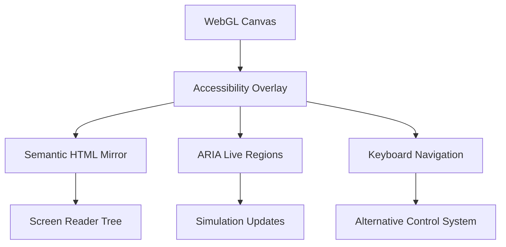

Technical implementation guide for **Card 11: Accessibility Audit** in the C_Structures web application, addressing WCAG 2.1 AA compliance through both programmatic and semantic enhancements:

---

# **Card 11: Accessibility Audit - Technical Implementation Guide**
**Objective:** Achieve full WCAG 2.1 AA compliance while maintaining real-time 3D performance.

---

## **1. 3D Canvas Accessibility Architecture**


---

## **2. Core Accessibility Implementation**

### **2.1 WebGL Accessibility Proxy**
```tsx
// src/components/CanvasAccessibility.tsx
const CanvasAccessibility = () => {
  const { nodes, beams } = useStore();
  
  return (
    <div 
      role="application"
      aria-label="3D Structural Analysis Canvas"
      aria-describedby="canvas-instructions"
      className="sr-only"
    >
      <div id="canvas-instructions">
        Interactive 3D structural analysis workspace. Use arrow keys to navigate.
      </div>
      
      <ol aria-live="polite">
        {nodes.map(node => (
          <li key={node.id}>
            <AccessibleNode node={node} />
          </li>
        ))}
      </ol>
      
      <dl aria-live="polite">
        {beams.map(beam => (
          <AccessibleBeam key={beam.id} beam={beam} />
        ))}
      </dl>
    </div>
  );
};

const AccessibleNode = ({ node }) => (
  <div
    role="button"
    tabIndex="0"
    aria-label={`Node ${node.id} at position ${node.position.join(', ')}`}
    onKeyDown={handleNodeKeyEvents}
  >
    <span aria-hidden="true">📍</span>
    <div className="sr-only">
      {node.constraints.fixed ? 'Fixed support' : 'Free node'}
    </div>
  </div>
);
```

---

### **3. Advanced Interaction Handling**

#### **3.1 Spatial Keyboard Navigation**
```typescript
// src/lib/spatialNavigation.ts
class SpatialNavigator {
  private focusGrid: Map<string, HTMLElement> = new Map();
  
  register3DElement(element: HTMLElement, position: Vector3) {
    const gridKey = `${Math.round(position.x)},${Math.round(position.z)}`;
    this.focusGrid.set(gridKey, element);
  }

  handleArrowKey(e: KeyboardEvent) {
    const currentPos = this.currentFocusedPosition;
    let newKey: string;
    
    switch(e.key) {
      case 'ArrowUp': 
        newKey = `${currentPos.x},${currentPos.z - 1}`;
        break;
      case 'ArrowDown':
        newKey = `${currentPos.x},${currentPos.z + 1}`;
        break;
      // ... other directions
    }

    this.focusGrid.get(newKey)?.focus();
  }
}
```

#### **3.2 Force Value Sonification**
```typescript
// src/lib/sonification.ts
export class ForceSonifier {
  private audioContext = new AudioContext();
  
  playForceValue(force: number) {
    const frequency = this.scaleForceToFrequency(force);
    const oscillator = this.audioContext.createOscillator();
    oscillator.type = 'sine';
    oscillator.frequency.setValueAtTime(frequency, this.audioContext.currentTime);
    
    const gain = this.audioContext.createGain();
    gain.gain.setValueAtTime(0.1, 0);
    
    oscillator.connect(gain).connect(this.audioContext.destination);
    oscillator.start();
    oscillator.stop(this.audioContext.currentTime + 0.5);
  }

  private scaleForceToFrequency(force: number) {
    return Math.max(100, Math.min(2000, Math.abs(force) * 10));
  }
}
```

---

## **4. Color & Contrast Enhancements**

### **4.1 Adaptive Color Mapping**
```glsl
// src/shaders/contrastShader.glsl
uniform float u_ContrastBoost;
uniform sampler2D u_ColorRamp;

vec4 getAccessibleColor(float force) {
  vec4 baseColor = texture2D(u_ColorRamp, vec2(force, 0.5));
  
  // WCAG contrast enhancement
  float luminance = dot(baseColor.rgb, vec3(0.2126, 0.7152, 0.0722));
  vec3 contrastColor = baseColor.rgb * (1.0 + u_ContrastBoost);
  
  return vec4(
    mix(baseColor.rgb, contrastColor, 
      step(0.5, luminance) * (1.0 - u_ContrastBoost)
    ),
    baseColor.a
  );
}
```

### **4.2 Pattern Library for Color Deficiency**
```tsx
// src/components/BeamPatterns.tsx
const PATTERNS = {
  tension: `<pattern id="tension" width="4" height="4" patternUnits="userSpaceOnUse">
    <path d="M-1,1 l2,-2 M0,4 l4,-4 M3,5 l2,-2" stroke="#0000ff" />
  </pattern>`,
  compression: `<pattern id="compression" width="4" height="4">
    <circle cx="2" cy="2" r="1" fill="#ff0000" />
  </pattern>`
};

const BeamPatterns = () => (
  <svg aria-hidden="true" style={{ position: 'absolute' }}>
    <defs dangerouslySetInnerHTML={{ __html: Object.values(PATTERNS).join('') }} />
  </svg>
);
```

---

## **5. Motion & Animation Control**

### **5.1 Reduced Motion Integration**
```typescript
// src/stores/accessibilityStore.ts
class AccessibilityStore {
  reduceMotion = window.matchMedia('(prefers-reduced-motion: reduce)').matches;
  
  constructor() {
    makeAutoObservable(this);
    window.matchMedia('(prefers-reduced-motion: reduce)')
      .addListener(e => this.setReduceMotion(e.matches));
  }

  get animationSettings() {
    return this.reduceMotion ? {
      duration: 0,
      stiffness: 1000,
      damping: 100
    } : {
      duration: 300,
      stiffness: 150,
      damping: 15
    };
  }
}
```

### **5.2 Focus Management System**
```typescript
// src/lib/focusManager.ts
export class StructuralFocus {
  private observer = new MutationObserver(mutations => {
    this.checkFocusTraps();
  });

  initialize() {
    this.observer.observe(document.body, {
      childList: true,
      subtree: true,
      attributes: true
    });
  }

  private checkFocusTraps() {
    const focusable = document.querySelectorAll(`
      [role="application"]:not([aria-hidden]),
      [data-force-focus]
    `);
    
    focusable.forEach(el => {
      if (el.getBoundingClientRect().width === 0) {
        el.setAttribute('tabindex', '-1');
      }
    });
  }
}
```

---

## **6. Validation & Testing Protocol**

### **6.1 Automated Testing Matrix**
| Tool                | Purpose                          | Threshold      |
|---------------------|----------------------------------|----------------|
| axe-core            | WCAG rule compliance             | 0 violations   |
| Lighthouse          | Accessibility score              | 95+            |
| Pa11y               | Navigation flow                  | 100% pass      |
| Color Contrast Checker | Text/UI elements              | AA minimum     |

### **6.2 Manual Testing Checklist**
1. **Screen Readers**
   - NVDA/Firefox: Full structure navigation
   - VoiceOver/Safari: Canvas description comprehension
   - JAWS/Chrome: Interactive element activation

2. **Keyboard Navigation**
   - Tab order matches visual layout
   - Spatial arrow key navigation
   - Escape/cancel patterns

3. **Color Perception**
   - Simulate protanopia/deuteranopia
   - Pattern recognition effectiveness
   - Contrast in high/low brightness

4. **Motion Validation**
   - Toggle reduced motion effects
   - Animation frame rate impact
   - Vestibular safety checks

---

## **7. Continuous Compliance**

### **7.1 Accessibility CI Pipeline**
```yaml
# .github/workflows/accessibility.yml
name: Accessibility
on: [push, pull_request]

jobs:
  audit:
    runs-on: ubuntu-latest
    steps:
      - uses: actions/checkout@v4
      - run: npm ci
      - run: npm run build
      - uses: treosh/axe-puppeteer@v3
        with:
          urls: "http://localhost:3000"
          save: axe-reports/
          threshold: critical=0, serious=0
      - uses: actions/upload-artifact@v3
        if: failure()
        with:
          name: accessibility-report
          path: axe-reports/
```

### **7.2 Real User Monitoring**
```typescript
// src/lib/a11yTelemetry.ts
export function trackAccessibilityEvents() {
  document.addEventListener('focus', (e) => {
    sendMetric('focus', {
      element: e.target?.tagName,
      ariaRole: e.target?.getAttribute('role'),
      isKeyboard: e.sourceCapabilities?.firesTouchEvents
    });
  });

  a11yAuditor.on('violation', (violation) => {
    logError('a11y_violation', {
      id: violation.id,
      impact: violation.impact,
      tags: violation.tags
    });
  });
}
```

---

## **8. Completion Criteria**
✅ 0 axe-core critical/serious violations  
✅ Lighthouse accessibility score ≥95  
✅ Full keyboard navigation coverage  
✅ Screen reader semantic structure validation  
✅ WCAG 2.1 AA color contrast compliance  
✅ Reduced motion support  
✅ Accessible error recovery paths  
✅ Permanent telemetry monitoring  

Next move to **Card 12: Demo Video Production** to showcase accessibility features in action.