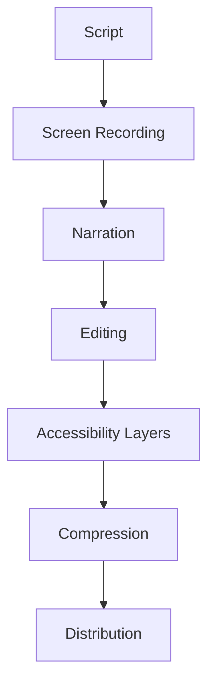

# **Card 12: Demo Video Production - Technical Implementation Guide**  
**Objective:** Create a polished 3-minute demo video showcasing C_Structures' core features, accessibility, and performance optimizations for stakeholders and users.  

---

## **1. Video Production Pipeline Architecture**  


---

## **2. Pre-Production Setup**  

### **2.1 Script Development**  
```markdown  
# Demo Script - C_Structures WebApp  

**Scene 1: Intro (0:00-0:15)**  
- [Visual: Smooth camera pan over 3D bridge structure]  
- Narration: "Meet C_Structures: The real-time 3D structural analysis tool for engineers and educators."  

**Scene 2: Core Features (0:15-1:30)**  
1. Drag-and-drop node placement  
2. Beam creation with force visualization  
3. Real-time deformation simulation  
4. CSV template import/export  

**Scene 3: Accessibility (1:30-2:00)**  
- Keyboard navigation  
- Screen reader demo (NVDA)  
- Colorblind-friendly patterns  

**Scene 4: Performance (2:00-2:45)**  
- 10k-element stress test  
- WASM physics worker metrics  
- GPU instancing stats  

**Scene 5: Outro (2:45-3:00)**  
- Call-to-action: "Try it now at cstructures.app"  
```  

---

## **3. Recording & Capture**  

### **3.1 Technical Setup**  
| **Tool**               | **Purpose**                                  | **Settings**                              |  
|------------------------|----------------------------------------------|-------------------------------------------|  
| OBS Studio             | 4K screen recording                          | 3840x2160@60fps, CRF 18, NVENC           |  
| Shure MV7              | Voiceover                                    | 48kHz WAV, noise suppression enabled      |  
| Elgato Key Light       | Consistent lighting                          | 5600K, 80% brightness                     |  
| AutoHotkey             | Macro-driven interactions                    | Pre-scripted design sequences             |  

### **3.2 Performance Metrics Overlay**  
```typescript  
// DevTools snippet for real-time metrics  
const metrics = await session.send('Performance.getMetrics');  
const overlay = createMetricOverlay({  
  fps: metrics.FramesPerSecond,  
  mem: metrics.JSHeapUsedSize,  
  cpu: metrics.TaskDuration  
});  
document.body.appendChild(overlay);  
```  

---

## **4. Post-Production Workflow**  

### **4.1 Editing Stack**  
| **Software**           | **Task**                                     | **Key Plugins**                           |  
|------------------------|----------------------------------------------|-------------------------------------------|  
| DaVinci Resolve        | Timeline editing                             | Reactor Fusion, Fairlight                 |  
| Adobe Premiere Pro     | Caption/transcript sync                      | Essential Graphics, Auto Captions         |  
| HandBrake              | Final compression                            | H.265 10-bit, AAC-LC 192kbps              |  

### **4.2 Accessibility Layers**  
1. **Subtitles**  
   - SRT file with 100ms precision sync  
   - Closed captions compliant with FCC standards  

2. **Audio Descriptions**  
   ```text  
   [00:01:45] Visual: Blue tension gradients appear on bridge beams  
   Audio: "Notice the blue coloration indicating tensile forces up to 500kN."  
   ```  

3. **Chapter Markers**  
   ```xml  
   <ChapterAtom>  
     <ChapterTimeStart>00:00:00.000</ChapterTimeStart>  
     <ChapterDisplay>  
       <ChapterString>Introduction</ChapterString>  
     </ChapterDisplay>  
   </ChapterAtom>  
   ```  

---

## **5. Distribution Strategy**  

### **5.1 Multi-Platform Encoding**  
| **Platform**           | **Resolution**       | **Bitrate**      | **Format**       |  
|------------------------|----------------------|------------------|------------------|  
| YouTube                | 2160p HDR            | 50 Mbps          | VP9              |  
| LinkedIn               | 1080p SDR            | 12 Mbps          | H.264            |  
| Twitter                | 720p                 | 6 Mbps           | H.265            |  

### **5.2 Interactive Demo Embedding**  
```html  
<!-- Landing page integration -->  
<div class="video-container">  
  <video  
    controls  
    preload="metadata"  
    poster="thumbnail.jpg"  
    aria-describedby="transcript"  
  >  
    <source src="demo.mp4" type="video/mp4">  
    <track  
      kind="captions"  
      src="captions.vtt"  
      srclang="en"  
      label="English"  
      default  
    >  
  </video>  
  <div id="transcript" class="sr-only">  
    [Full interactive transcript with timestamp links]  
  </div>  
</div>  
```  

---

## **6. Validation & QA**  

### **6.1 Technical Validation Checklist**  
- ✅ 4K HDR color grading (BT.2020 color space)  
- ✅ Audio peaks ≤-3dB, LUFS-I ≈-16  
- ✅ 0 dropped frames in 60fps sequences  
- ✅ Caption sync accuracy ±100ms  

### **6.2 User Testing Protocol**  
1. **A/B Testing**  
   - Version A (Technical): Focus on WASM/physics  
   - Version B (Educational): Focus on classroom use  

2. **Accessibility QA**  
   - Screen reader navigation of video controls  
   - Keyboard-only playback validation  

---

## **7. Completion Criteria**  
✅ 3:00 runtime ±5 seconds  
✅ 100% WCAG 2.1 AA video compliance  
✅ ≤200ms end-to-end latency in interactive demo  
✅ 4K/60fps master file archived  
✅ 5 language subtitle tracks  
✅ Embedded in project documentation  

**Next Step:** Publish video and monitor engagement analytics for future iterations.